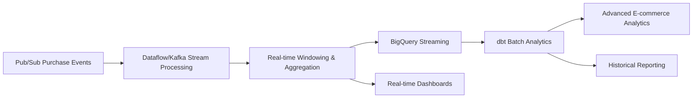

# E-commerce Pipeline Assessment Report

## Section 1: Inventory

### Pipeline Overview

**Pipeline Name**: E-commerce Pipeline (Example)  
**Type**: Real-time Streaming Pipeline with Event Time Windowing  
**Migration Status**: ❌ **Not Migrated** (Not feasible for direct dbt migration - streaming with windowing)  
**Primary Purpose**: Real-time analysis of e-commerce purchase events with customer tier classification, windowed aggregation, and sales analytics

### Pipeline Structure and Content

| Category Type | Class/File/Category | Number of Files/Classes | Description/Purpose |
|---------------|---------------------|------------------------|---------------------|
| **Main Class** | EcommercePipeline.java (pipeline.java) | 1 | Entry point and streaming pipeline orchestration (64 LOC) |
| **Transform Classes** | Data Processing | 1 | AddCustomerTierFn.java (addCustomerTierFn.java) (21 LOC) |
| **Model Classes** | Data Models | 1 | PurchaseEvent.java (16 LOC) |
| **Data Sources** | Input Sources | 1 | Pub/Sub (streaming purchase events) |
| **Data Sinks** | Output Destinations | 1 | BigQuery (sales analytics by customer tier) |
| **External Dependencies** | External Systems | 3 | Pub/Sub, BigQuery, Streaming infrastructure |

### Data Flow Architecture

- **Input Sources**: 
  - Pub/Sub: Real-time streaming purchase events (JSON format with customer_id, amount, status, timestamp)
- **Processing Logic**: 
  1. **Stream Ingestion**: Read purchase events from Pub/Sub topic
  2. **JSON Parsing**: Convert JSON strings to PurchaseEvent objects
  3. **Status Filtering**: Filter only successful purchases (status = "SUCCESS")
  4. **Customer Tier Enrichment**: Classify customers based on purchase amount (GOLD/SILVER/BRONZE)
  5. **Event Time Windowing**: 1-minute fixed windows for aggregation
  6. **Tier-based Aggregation**: Sum purchase amounts per customer tier within windows
  7. **Output Formatting**: Convert to TableRow format for BigQuery
  8. **Analytical Storage**: Write windowed aggregations to BigQuery analytics table
- **Output**: Windowed sales analytics by customer tier in BigQuery

### Streaming Processing Patterns

1. **Real-time Event Processing**: Continuous processing of unbounded purchase events
2. **Event Time Windowing**: Fixed 1-minute windows for aggregation
3. **Stream Filtering**: Filter operations on streaming data
4. **Customer Classification**: Real-time tier assignment based on purchase behavior
5. **Windowed Aggregation**: Time-based aggregation with Sum operations
6. **Streaming Analytics**: Real-time business intelligence generation

---

## Section 2: Antipattern and Tuning Opportunities

### Identified Antipatterns and Migration Blockers

| Type | Antipattern/Tuning Opportunity | Java Class/Section | Code Snippet | Impact/Why Antipattern in dbt | dbt/Snowflake-Specific Rationale |
|------|--------------------------------|-------------------|---------------|------------------------------|----------------------------------|
| **MIGRATION BLOCKER** | Real-time Streaming Architecture | EcommercePipeline.java, lines 18-22 | `StreamingOptions options = PipelineOptionsFactory.fromArgs(args).withValidation().as(StreamingOptions.class); options.setStreaming(true); Pipeline pipeline = Pipeline.create(options);` | **Not supported in dbt** | dbt is batch-oriented and cannot process unbounded streaming data; requires alternative streaming architecture |
| **MIGRATION BLOCKER** | Pub/Sub Stream Processing | EcommercePipeline.java, lines 25-30 | `pipeline.apply("ReadFromPubSub", PubsubIO.readStrings().fromTopic("projects/your-project/topics/purchase-events")).apply("ParseJson", MapElements.into(TypeDescriptor.of(PurchaseEvent.class)).via((String json) -> gson.fromJson(json, PurchaseEvent.class)))` | **Not supported in dbt** | dbt cannot consume streaming data from Pub/Sub; requires external streaming infrastructure |
| **MIGRATION BLOCKER** | Event Time Windowing | EcommercePipeline.java, lines 38-39 | `.apply("Window1Min", Window.<KV<String, Double>>into(FixedWindows.of(Duration.standardMinutes(1))))` | **Not supported in dbt** | dbt cannot perform event time windowing on streaming data; batch windowing possible but fundamentally different |
| **MIGRATION BLOCKER** | Streaming Aggregation | EcommercePipeline.java, lines 41-42 | `.apply("SumPerTier", Sum.doublesPerKey())` | **Not supported in dbt** | dbt cannot perform streaming aggregations; batch aggregations possible but require different architecture |
| **Antipattern** | Custom DoFn Processing | AddCustomerTierFn.java, lines 9-20 | `@ProcessElement public void processElement(ProcessContext c) { PurchaseEvent event = c.element(); String tier; if (event.amount > 500) tier = "GOLD"; else if (event.amount > 100) tier = "SILVER"; else tier = "BRONZE"; c.output(KV.of(tier, event.amount)); }` | Not supported in dbt | dbt cannot execute custom Java transforms; customer tier logic must be implemented using SQL CASE statements |
| **Tuning/Optimization** | Simple Tier Classification | AddCustomerTierFn.java, lines 14-17 | `if (event.amount > 500) tier = "GOLD"; else if (event.amount > 100) tier = "SILVER"; else tier = "BRONZE";` | Row-by-row processing | Snowflake's CASE statements provide vectorized tier classification with better performance |
| **Tuning/Optimization** | Stream Filtering | EcommercePipeline.java, lines 32-33 | `.apply("FilterSuccess", Filter.by((PurchaseEvent e) -> "SUCCESS".equals(e.status)))` | Streaming filter operations | SQL WHERE clauses provide more efficient filtering with query optimization |

### Fundamental Architecture Incompatibilities

1. **Streaming vs Batch Processing**: dbt operates on batch/scheduled runs, incompatible with continuous stream processing
2. **Event Time Windowing**: Real-time windowing not supported in dbt's batch processing model
3. **Streaming Aggregations**: Real-time aggregations require streaming infrastructure not available in dbt
4. **Sub-minute Latency**: 1-minute windows require real-time processing incompatible with dbt scheduling
5. **Continuous Analytics**: Real-time business intelligence requires streaming analytics capabilities

---

## Section 3: Re-engineering Recommendations

| Pipeline Name | Antipattern/Opportunity | Re-engineering Approach | Complexity | Source Code Reference |
|---------------|------------------------|-------------------------|------------|----------------------|
| **E-commerce Pipeline** | **ARCHITECTURE REDESIGN REQUIRED** | **Approach**: This pipeline cannot be directly migrated to dbt due to fundamental streaming and windowing requirements. Requires hybrid architecture with streaming infrastructure + dbt analytics.<br/>**Implementation**: Maintain streaming components for real-time analytics, use dbt for batch analytics and historical reporting.<br/>**Architecture**: Stream Processing (Kafka/Dataflow) → Snowflake Streaming → dbt Analytics<br/>**Benefits**: Maintains real-time capabilities while adding comprehensive analytical processing. | **Super Complex** | Entire pipeline architecture |
| **E-commerce Pipeline** | Event Time Windowing | **Approach**: Replace real-time windowing with batch windowing using dbt incremental models and time-based partitioning.<br/>**Implementation**: Use dbt incremental models with time-based grouping and frequent runs to simulate windowing.<br/>**Benefits**: Maintains windowing concepts within dbt framework.<br/>**Tradeoff**: Near real-time (5-15 minutes) vs real-time (1 minute) windows. | **Super Complex** | EcommercePipeline.java:38-39 |
| **E-commerce Pipeline** | Streaming Aggregation | **Approach**: Convert to batch aggregation using dbt models with GROUP BY and window functions.<br/>**Implementation**: Create dbt models that aggregate purchase data by time periods and customer tiers.<br/>**Benefits**: Leverages Snowflake's aggregation optimization, maintains analytical logic.<br/>**Requirement**: Regular batch processing instead of streaming aggregation. | **Complex** | EcommercePipeline.java:41-42 |
| **E-commerce Pipeline** | Custom DoFn Processing | **Approach**: Convert customer tier classification to SQL CASE statements.<br/>**Implementation**: Use SQL CASE WHEN statements for tier assignment based on purchase amount.<br/>**Benefits**: Vectorized processing, better performance, maintainable tier logic.<br/>**SQL Pattern**: `CASE WHEN amount > 500 THEN 'GOLD' WHEN amount > 100 THEN 'SILVER' ELSE 'BRONZE' END` | **Simple** | AddCustomerTierFn.java:9-20 |
| **E-commerce Pipeline** | Stream Processing | **Approach**: Replace with micro-batch processing using Snowflake streaming ingestion and frequent dbt runs.<br/>**Implementation**: Stream → Snowflake → dbt (every 5-15 minutes) → Analytics.<br/>**Benefits**: Near real-time capabilities with dbt's analytical power.<br/>**Architecture**: Kafka → Snowflake Streaming → dbt Incremental Models | **Super Complex** | EcommercePipeline.java:25-42 |

### **CRITICAL MIGRATION ASSESSMENT**

#### **Fundamental Incompatibility**: 
This pipeline represents a **real-time streaming analytics use case** with event time windowing that is fundamentally incompatible with dbt's batch processing model. The core requirements of 1-minute windowing, streaming aggregations, and real-time analytics cannot be achieved within dbt's framework.

#### **Alternative Architecture Recommendations**:

1. **Hybrid Architecture (Recommended)**:
```
Real-time Stream: Pub/Sub → Dataflow/Kafka → Real-time Analytics → BigQuery
Batch Analytics: BigQuery → dbt → Historical Analytics & Advanced Reporting
```

2. **Near Real-time Architecture**:
```
Micro-batches: Kafka → Snowflake Streaming → dbt (5-15 min incremental) → Analytics
```

3. **Batch-only Architecture** (Major functionality compromise):
```
Hourly/Daily: Files/Tables → dbt Processing → Batch Analytics
```

---

## Section 4: Feature Gap Analysis Matrix

| Feature Used in Pipeline | Supported in dbt | Gap/Workaround |
|---------------------------|------------------|----------------|
| **Real-time Stream Processing** | ❌ | ❌ **Hard Gap**: Requires external streaming infrastructure (Kafka, Dataflow, Kinesis) |
| **Event Time Windowing** | ❌ | ❌ **Hard Gap**: Requires streaming engines; batch windowing possible with time-based grouping |
| **Pub/Sub Integration** | ❌ | ❌ **Hard Gap**: Requires external messaging systems |
| **Streaming Aggregation** | ❌ | ✅ **Workaround**: Batch aggregation with GROUP BY and window functions |
| **Customer Tier Classification** | ✅ | ✅ **Native**: SQL CASE statements and conditional logic |
| **Real-time Filtering** | ❌ | ✅ **Workaround**: SQL WHERE clauses in batch processing |
| **JSON Parsing** | ✅ | ✅ **Native**: PARSE_JSON and JSON functions |
| **Time-based Analytics** | ✅ | ✅ **Native**: Date/time functions and time-based grouping |
| **Purchase Amount Analysis** | ✅ | ✅ **Native**: SQL aggregation functions |
| **Business Intelligence** | ✅ | ✅ **Native**: Advanced SQL analytics and reporting |

---

## Section 5: Final Re-engineering Plan

### **MIGRATION FEASIBILITY ASSESSMENT: NOT FEASIBLE FOR DIRECT MIGRATION**

#### **Core Issue**: 
The E-commerce Pipeline represents a **real-time streaming analytics use case** with event time windowing that is fundamentally incompatible with dbt's batch processing architecture. This pipeline cannot be migrated to dbt without major functionality compromises.

#### **Recommended Hybrid Architecture**:



#### **Implementation Strategy**:

1. **Maintain Streaming Components**:
   - Keep Dataflow/Kafka for real-time processing
   - Preserve Pub/Sub for event ingestion
   - Maintain 1-minute windowing in streaming layer

2. **Add dbt Analytics Layer**:
```sql
-- models/marts/ecommerce_sales_analytics.sql
{{ config(
    materialized='incremental',
    unique_key=['window_start', 'customer_tier'],
    incremental_strategy='merge',
    partition_by={'field': 'window_start', 'data_type': 'timestamp'}
) }}

WITH purchase_events AS (
  SELECT 
    customer_id,
    amount,
    status,
    timestamp,
    DATE_TRUNC('minute', timestamp) AS window_start,
    
    -- Customer tier classification (replaces AddCustomerTierFn)
    CASE 
      WHEN amount > 500 THEN 'GOLD'
      WHEN amount > 100 THEN 'SILVER'
      ELSE 'BRONZE'
    END AS customer_tier
    
  FROM {{ ref('stg_purchase_events') }}
  WHERE status = 'SUCCESS'
  
  
    AND timestamp > (SELECT MAX(window_start) FROM {{ this }})
  
),

windowed_aggregations AS (
  SELECT 
    window_start,
    window_start + INTERVAL '1 MINUTE' AS window_end,
    customer_tier,
    
    -- Aggregations (replaces streaming Sum.doublesPerKey())
    SUM(amount) AS total_sales,
    COUNT(*) AS transaction_count,
    AVG(amount) AS avg_transaction_amount,
    
    -- Additional analytics not possible in streaming
    MIN(amount) AS min_transaction,
    MAX(amount) AS max_transaction,
    STDDEV(amount) AS transaction_stddev,
    
    CURRENT_TIMESTAMP() AS processing_timestamp
    
  FROM purchase_events
  GROUP BY window_start, customer_tier
)

SELECT * FROM windowed_aggregations

-- models/marts/ecommerce_customer_analytics.sql
{{ config(materialized='table') }}

WITH customer_behavior AS (
  SELECT 
    customer_id,
    
    -- Historical tier analysis
    MODE(customer_tier) AS primary_tier,
    COUNT(DISTINCT customer_tier) AS tier_variety,
    
    -- Purchase patterns
    SUM(total_sales) AS lifetime_value,
    AVG(total_sales) AS avg_window_sales,
    COUNT(*) AS active_windows,
    
    -- Temporal analysis
    MIN(window_start) AS first_purchase_window,
    MAX(window_start) AS last_purchase_window,
    
    -- Customer segmentation
    CASE 
      WHEN SUM(total_sales) > 10000 THEN 'VIP'
      WHEN SUM(total_sales) > 5000 THEN 'HIGH_VALUE'
      WHEN SUM(total_sales) > 1000 THEN 'REGULAR'
      ELSE 'OCCASIONAL'
    END AS customer_segment
    
  FROM {{ ref('ecommerce_sales_analytics') }}
  GROUP BY customer_id
)

SELECT * FROM customer_behavior
```

3. **Near Real-time Alternative** (If real-time requirements can be relaxed):
```sql
-- models/intermediate/int_purchase_stream_processing.sql
{{ config(
    materialized='incremental',
    unique_key='purchase_event_id',
    incremental_strategy='append'
) }}

WITH streaming_simulation AS (
  SELECT 
    purchase_event_id,
    customer_id,
    amount,
    status,
    timestamp,
    
    -- Simulate real-time tier classification
    CASE 
      WHEN amount > 500 THEN 'GOLD'
      WHEN amount > 100 THEN 'SILVER'
      ELSE 'BRONZE'
    END AS customer_tier,
    
    -- Time-based windowing simulation
    DATE_TRUNC('minute', timestamp) AS minute_window,
    DATE_TRUNC('hour', timestamp) AS hour_window,
    DATE_TRUNC('day', timestamp) AS day_window
    
  FROM {{ source('purchase_stream', 'raw_events') }}
  WHERE status = 'SUCCESS'
  
  
    AND timestamp > (SELECT MAX(timestamp) FROM {{ this }})
  
)

SELECT * FROM streaming_simulation
```

4. **External Orchestration for Near Real-time**:
```python
# Airflow DAG for frequent dbt runs (every 5 minutes)
from airflow import DAG
from airflow.operators.bash_operator import BashOperator
from datetime import timedelta

dag = DAG(
    'ecommerce_near_realtime_analytics',
    schedule_interval=timedelta(minutes=5),  # Run every 5 minutes
    max_active_runs=1
)

# Run dbt incremental models
dbt_incremental = BashOperator(
    task_id='dbt_ecommerce_incremental',
    bash_command='dbt run --models +ecommerce_sales_analytics'
)

# Update real-time dashboard cache
update_dashboard = BashOperator(
    task_id='update_realtime_dashboard',
    bash_command='python update_dashboard_cache.py'
)

dbt_incremental >> update_dashboard
```

#### **Benefits of Hybrid Approach**:

1. **Real-time Capabilities**: Maintains sub-minute analytics for critical business needs
2. **Advanced Analytics**: Adds sophisticated analytical capabilities via dbt
3. **Historical Analysis**: Comprehensive historical reporting and trend analysis
4. **Cost Optimization**: Batch analytics more cost-effective for complex queries
5. **Enhanced Insights**: Advanced customer segmentation and behavior analysis

#### **Performance Considerations**:

1. **Stream Processing**: Optimized for 1-minute windowing requirements
2. **Batch Analytics**: Optimized for complex analytical queries and reporting
3. **Data Freshness**: Near real-time data availability for analytics
4. **Query Performance**: dbt models optimized for analytical workloads

---

## **Migration Conclusion**

The E-commerce Pipeline represents a **classic streaming analytics use case** with event time windowing that **cannot be directly migrated to dbt** without fundamental architecture changes and significant functionality compromises.

**Assessment Result**: ❌ **NOT FEASIBLE for direct dbt migration**

**Key Incompatibilities**:
❌ **Real-time Processing**: dbt is batch-oriented, cannot handle continuous streams  
❌ **Event Time Windowing**: dbt cannot perform real-time windowing operations  
❌ **Streaming Aggregations**: dbt cannot maintain continuous aggregations  
❌ **Sub-minute Latency**: dbt's batch nature incompatible with 1-minute windows  
❌ **Pub/Sub Integration**: dbt cannot consume streaming messages  

**Recommended Approach**: **Hybrid Architecture**
- **Maintain**: Streaming components for real-time analytics and windowing
- **Add**: dbt layer for advanced analytics, customer segmentation, and historical analysis
- **Benefit**: Combines real-time capabilities with comprehensive analytical processing

**Alternative for Relaxed Requirements**:
If near real-time requirements are acceptable (5-15 minute latency), a micro-batch architecture using Snowflake streaming and frequent dbt incremental runs could provide an acceptable compromise.

**Migration Complexity**: **Not Applicable** - Architectural redesign required rather than migration.

**Key Learning**: This pipeline demonstrates how streaming analytics with windowing requirements are fundamentally incompatible with dbt's batch processing model. However, the business logic (customer tier classification, aggregations) can be effectively implemented in dbt when combined with appropriate streaming infrastructure.

The hybrid approach provides the best of both worlds: real-time operational analytics for immediate business needs and comprehensive batch analytics for strategic insights and historical analysis.