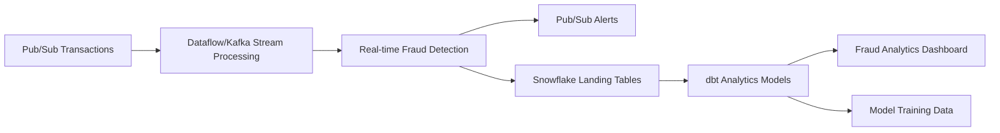

# Fraud Detection Pipeline (Basic) Assessment Report

## Section 1: Inventory

### Pipeline Overview

**Pipeline Name**: Fraud Detection Pipeline (Basic)  
**Type**: Real-time Streaming Pipeline with Side Input Processing  
**Migration Status**: ❌ **Not Migrated** (Not feasible for direct dbt migration - streaming architecture)  
**Primary Purpose**: Real-time fraud detection on streaming transaction data using customer profiles and anomaly detection based on spending patterns

### Pipeline Structure and Content

| Category Type | Class/File/Category | Number of Files/Classes | Description/Purpose |
|---------------|---------------------|------------------------|---------------------|
| **Main Class** | FraudDetectionPipeline.java | 1 | Entry point and streaming pipeline orchestration (80 LOC) |
| **Transform Classes** | Data Processing | 2 | DeduplicateFn.java (28 LOC), EnrichWithCustomerProfileFn.java (24 LOC) |
| **Model Classes** | Data Models | 1 | Transaction.java (18 LOC) |
| **Data Sources** | Input Sources | 2 | Pub/Sub (streaming transactions), BigQuery (customer profiles) |
| **Data Sinks** | Output Destinations | 3 | Pub/Sub (suspicious alerts), BigQuery (suspicious transactions), BigQuery (normal transactions) |
| **External Dependencies** | External Systems | 3 | Pub/Sub, BigQuery, Streaming infrastructure |

### Data Flow Architecture

- **Input Sources**: 
  - Pub/Sub: Real-time streaming transaction data (JSON format)
  - BigQuery: Customer profiles with historical spending averages
- **Processing Logic**: 
  1. **Stream Ingestion**: Read transaction stream from Pub/Sub topic
  2. **JSON Parsing**: Convert JSON strings to Transaction objects
  3. **Deduplication**: Remove duplicate transactions using stateful processing
  4. **Profile Enrichment**: Join with customer profiles using side input
  5. **Fraud Detection**: Compare transaction amount to 3x customer average
  6. **Stream Splitting**: Route to suspicious/normal outputs based on rules
  7. **Multi-sink Output**: Write to both Pub/Sub and BigQuery sinks
- **Output**: Real-time alerts to Pub/Sub + persistent storage in BigQuery tables

### Streaming Processing Patterns

1. **Real-time Stream Processing**: Continuous processing of unbounded data
2. **Stateful Deduplication**: Use of Beam state/timers for duplicate detection
3. **Side Input Joins**: Customer profile lookup using broadcast patterns
4. **Multiple Output Streams**: TupleTags for suspicious/normal classification
5. **Multi-sink Architecture**: Parallel writing to multiple destinations

---

## Section 2: Antipattern and Tuning Opportunities

### Identified Antipatterns and Migration Blockers

| Type | Antipattern/Tuning Opportunity | Java Class/Section | Code Snippet | Impact/Why Antipattern in dbt | dbt/Snowflake-Specific Rationale |
|------|--------------------------------|-------------------|---------------|------------------------------|----------------------------------|
| **MIGRATION BLOCKER** | Real-time Streaming Architecture | FraudDetectionPipeline.java, lines 20-22 | `StreamingOptions options = PipelineOptionsFactory.fromArgs(args).withValidation().as(StreamingOptions.class); options.setStreaming(true); Pipeline p = Pipeline.create(options);` | **Not supported in dbt** | dbt is batch-oriented and cannot process unbounded streaming data; requires alternative streaming architecture |
| **MIGRATION BLOCKER** | Pub/Sub Stream Processing | FraudDetectionPipeline.java, lines 29-33 | `PCollection<Transaction> transactions = p.apply("ReadPubSub", PubsubIO.readStrings().fromTopic("projects/your-project/topics/transactions")).apply("ParseJson", MapElements.into(TypeDescriptor.of(Transaction.class)).via(json -> gson.fromJson(json, Transaction.class)));` | **Not supported in dbt** | dbt cannot consume streaming data from Pub/Sub; requires external streaming infrastructure |
| **MIGRATION BLOCKER** | Stateful Processing | DeduplicateFn.java, lines 8-27 | `@StateId("seenIds") private final StateSpec<ValueState<Boolean>> seenIds = StateSpecs.value(); @TimerId("expiry") private final TimerSpec expiryTimer = TimerSpecs.timer(TimeDomain.PROCESSING_TIME);` | **Not supported in dbt** | dbt cannot maintain state between executions; stateful deduplication requires external streaming systems |
| **MIGRATION BLOCKER** | Side Input Processing | FraudDetectionPipeline.java, lines 25-27 | `PCollectionView<Map<String, TableRow>> customerProfiles = p.apply("ReadCustomerProfiles", BigQueryIO.readTableRows().from("your-project:dataset.customer_profiles")).apply("ToMap", View.<String, TableRow>asMap(...));` | **Not supported in dbt** | dbt cannot create side input views; all joins must be explicit SQL table joins |
| **MIGRATION BLOCKER** | Multiple Output Streams | FraudDetectionPipeline.java, lines 35-54 | `final TupleTag<KV<Transaction, TableRow>> suspiciousTag = new TupleTag<>(){}; final TupleTag<KV<Transaction, TableRow>> normalTag = new TupleTag<>(){}; PCollectionTuple tagged = transactions.apply("EnrichAndDetectFraud", ParDo.of(new DoFn<Transaction, KV<Transaction, TableRow>>() {...}).withOutputTags(normalTag, TupleTagList.of(suspiciousTag)));` | **Not supported in dbt** | dbt models produce single outputs; real-time classification requires streaming infrastructure |
| **MIGRATION BLOCKER** | Real-time Alerting | FraudDetectionPipeline.java, lines 56-58 | `tagged.get(suspiciousTag).apply("ToPubSub", MapElements.into(TypeDescriptors.strings()).via(kv -> gson.toJson(kv.getKey()))).apply(PubsubIO.writeStrings().to("projects/your-project/topics/suspicious-transactions"));` | **Not supported in dbt** | dbt cannot publish real-time alerts to Pub/Sub; requires external alerting infrastructure |

### Fundamental Architecture Incompatibilities

1. **Streaming vs Batch Processing**: dbt operates on batch/scheduled runs, incompatible with continuous stream processing
2. **State Management**: Fraud detection requires maintaining state (seen transactions), which dbt cannot provide
3. **Real-time Requirements**: Sub-second response times for fraud alerts incompatible with dbt's batch processing model
4. **Side Input Patterns**: Customer profile lookups using broadcast patterns not supported in dbt
5. **Multi-sink Architecture**: Real-time routing to multiple destinations not achievable in dbt

---

## Section 3: Re-engineering Recommendations

| Pipeline Name | Antipattern/Opportunity | Re-engineering Approach | Complexity | Source Code Reference |
|---------------|------------------------|-------------------------|------------|----------------------|
| **Fraud Detection (Basic)** | **ARCHITECTURE REDESIGN REQUIRED** | **Approach**: This pipeline cannot be directly migrated to dbt due to fundamental streaming requirements. Requires hybrid architecture with streaming infrastructure + dbt analytics.<br/>**Implementation**: Maintain streaming components (Kafka/Dataflow) for real-time processing, use dbt for batch analytics and model training.<br/>**Architecture**: Stream Processing (Kafka/Dataflow) → Snowflake Landing → dbt Analytics<br/>**Benefits**: Maintains real-time capabilities while adding analytical processing power. | **Super Complex** | Entire pipeline architecture |
| **Fraud Detection (Basic)** | Real-time Stream Processing | **Approach**: Replace with near real-time batch processing using micro-batches and external orchestration.<br/>**Implementation**: Use Kafka/Kinesis for stream ingestion → Snowflake streaming ingestion → dbt incremental models with frequent runs.<br/>**Benefits**: Maintains near real-time capabilities with dbt's analytical power.<br/>**Tradeoff**: Slight latency increase (seconds to minutes) vs real-time. | **Super Complex** | FraudDetectionPipeline.java:20-33 |
| **Fraud Detection (Basic)** | Stateful Deduplication | **Approach**: Replace stateful processing with time-window based deduplication in dbt incremental models.<br/>**Implementation**: Use dbt incremental models with unique keys and time-based windows for deduplication.<br/>**Benefits**: Maintains deduplication logic within dbt framework.<br/>**Limitation**: Less precise than stateful processing, requires careful window sizing. | **Complex** | DeduplicateFn.java:8-27 |
| **Fraud Detection (Basic)** | Side Input Joins | **Approach**: Convert to standard SQL JOINs using dbt models and regular table updates.<br/>**Implementation**: Create dbt models that JOIN transaction data with customer profile tables.<br/>**Benefits**: Leverages SQL join optimization, maintains data lineage.<br/>**Requirement**: Customer profiles must be maintained as tables, not side inputs. | **Medium** | FraudDetectionPipeline.java:25-27 |
| **Fraud Detection (Basic)** | Real-time Alerting | **Approach**: Replace with batch alerting using external orchestration and Snowflake notifications.<br/>**Implementation**: Use dbt to identify suspicious transactions, external system (Airflow) to send alerts.<br/>**Benefits**: Maintains alerting capabilities with better monitoring and logging.<br/>**Tradeoff**: Batch alerting vs real-time alerts. | **Complex** | FraudDetectionPipeline.java:56-58 |

### **CRITICAL MIGRATION ASSESSMENT**

#### **Fundamental Incompatibility**: 
This pipeline represents a **fundamental architectural mismatch** with dbt's batch-oriented processing model. The core requirements of real-time fraud detection, stateful processing, and sub-second alerting cannot be achieved within dbt's framework.

#### **Alternative Architecture Recommendations**:

1. **Hybrid Architecture (Recommended)**:
```
Real-time Stream: Pub/Sub → Dataflow/Kafka → Real-time Alerts
Analytical Batch: Snowflake → dbt → Fraud Analytics & Model Training
```

2. **Near Real-time Architecture**:
```
Micro-batches: Kafka → Snowflake Streaming → dbt (5-min incremental) → Alerts
```

3. **Batch-only Architecture** (Major functionality compromise):
```
Files/Tables → dbt Processing → Batch Alerts (hourly/daily)
```

---

## Section 4: Feature Gap Analysis Matrix

| Feature Used in Pipeline | Supported in dbt | Gap/Workaround |
|---------------------------|------------------|----------------|
| **Real-time Stream Processing** | ❌ | ❌ **Hard Gap**: Requires external streaming infrastructure (Kafka, Dataflow, Kinesis) |
| **Pub/Sub Integration** | ❌ | ❌ **Hard Gap**: Requires external messaging systems |
| **Stateful Processing** | ❌ | ❌ **Hard Gap**: Requires external stream processing engines |
| **Side Input Joins** | ❌ | ✅ **Workaround**: Standard SQL JOINs with regular table updates |
| **Multiple Output Streams** | ❌ | ✅ **Workaround**: Multiple dbt models with conditional logic |
| **Real-time Alerting** | ❌ | ⚠️ **Gap**: Requires external alerting systems (Airflow, custom services) |
| **Deduplication Logic** | ✅ | ✅ **Native**: Window functions and incremental models |
| **Fraud Detection Rules** | ✅ | ✅ **Native**: SQL CASE statements and conditional logic |
| **Customer Profile Joins** | ✅ | ✅ **Native**: Standard SQL JOINs |
| **Data Type Parsing** | ✅ | ✅ **Native**: JSON functions and PARSE_JSON |

---

## Section 5: Final Re-engineering Plan

### **MIGRATION FEASIBILITY ASSESSMENT: NOT FEASIBLE FOR DIRECT MIGRATION**

#### **Core Issue**: 
The Fraud Detection Pipeline represents a **real-time streaming use case** that is fundamentally incompatible with dbt's batch processing architecture. This pipeline cannot be migrated to dbt without major functionality compromises.

#### **Recommended Hybrid Architecture**:



#### **Implementation Strategy**:

1. **Maintain Streaming Components**:
   - Keep Dataflow/Kafka for real-time processing
   - Preserve Pub/Sub for alerting
   - Maintain stateful deduplication in streaming layer

2. **Add dbt Analytics Layer**:
```sql
-- models/marts/fraud_analytics.sql
{{ config(
    materialized='incremental',
    unique_key='transaction_id',
    incremental_strategy='merge'
) }}

WITH suspicious_transactions AS (
  SELECT 
    transaction_id,
    customer_id,
    amount,
    timestamp,
    location,
    CASE 
      WHEN amount > customer_avg_amount * 3 THEN 'HIGH_AMOUNT_ANOMALY'
      WHEN location IN (SELECT location FROM {{ ref('blacklisted_locations') }})
      THEN 'BLACKLISTED_LOCATION'
      ELSE 'OTHER_SUSPICIOUS'
    END AS fraud_reason,
    
    CURRENT_TIMESTAMP() AS analysis_timestamp
    
  FROM {{ ref('stg_transaction_stream') }} t
  LEFT JOIN {{ ref('dim_customer_profiles') }} c
    ON t.customer_id = c.customer_id
  
  WHERE t.amount > c.avg_amount * 3
    OR t.location IN (SELECT location FROM {{ ref('blacklisted_locations') }})
    
  
    AND t.timestamp > (SELECT MAX(timestamp) FROM {{ this }})
  
)

SELECT * FROM suspicious_transactions
```

3. **External Orchestration Integration**:
```python
# Airflow DAG for fraud analytics
from airflow import DAG
from airflow.operators.bash_operator import BashOperator

dag = DAG('fraud_analytics_pipeline')

# Run dbt fraud analytics
dbt_fraud_analytics = BashOperator(
    task_id='dbt_fraud_analytics',
    bash_command='dbt run --models fraud_analytics'
)

# Update ML models with latest fraud patterns
update_ml_models = BashOperator(
    task_id='update_fraud_models',
    bash_command='python update_fraud_detection_models.py'
)

dbt_fraud_analytics >> update_ml_models
```

#### **Benefits of Hybrid Approach**:

1. **Real-time Capabilities**: Maintains sub-second fraud detection
2. **Advanced Analytics**: Adds sophisticated analytical capabilities via dbt
3. **Model Training**: Historical data for ML model improvement
4. **Operational Insights**: Better fraud pattern analysis and reporting
5. **Cost Optimization**: Batch analytics more cost-effective than stream processing

#### **Implementation Phases**:

**Phase 1**: Maintain existing streaming pipeline
**Phase 2**: Add Snowflake landing tables for stream output
**Phase 3**: Implement dbt analytics models for historical analysis
**Phase 4**: Integrate ML model training pipeline
**Phase 5**: Add advanced fraud analytics and reporting

#### **Performance Considerations**:

1. **Stream Processing**: Optimized for real-time requirements
2. **Batch Analytics**: Optimized for complex analytical queries
3. **Data Freshness**: Stream data lands in Snowflake with minimal delay
4. **Query Performance**: dbt models optimized for analytical workloads

---

## **Migration Conclusion**

The Fraud Detection Pipeline (Basic) represents a **classic streaming use case** that **cannot be directly migrated to dbt** without fundamental architecture changes and significant functionality compromises. 

**Assessment Result**: ❌ **NOT FEASIBLE for direct dbt migration**

**Key Incompatibilities**:
❌ **Real-time Processing**: dbt is batch-oriented, cannot handle continuous streams  
❌ **Stateful Operations**: dbt cannot maintain state between runs  
❌ **Sub-second Latency**: dbt's batch nature incompatible with real-time requirements  
❌ **Side Input Processing**: dbt requires explicit SQL joins, not broadcast patterns  
❌ **Real-time Alerting**: dbt cannot publish to messaging systems  

**Recommended Approach**: **Hybrid Architecture**
- **Maintain**: Streaming components for real-time fraud detection
- **Add**: dbt layer for advanced analytics, historical analysis, and ML model training
- **Benefit**: Combines real-time capabilities with advanced analytical processing

**Alternative for Batch-only Requirements**:
If real-time requirements can be relaxed, a near real-time architecture using Snowflake streaming and frequent dbt incremental runs (every 5-15 minutes) could provide an acceptable compromise.

**Migration Complexity**: **Not Applicable** - Architectural redesign required rather than migration.

This assessment demonstrates the importance of understanding fundamental architectural requirements when evaluating migration feasibility. Some use cases are better served by maintaining specialized streaming infrastructure while adding complementary analytical capabilities through dbt.