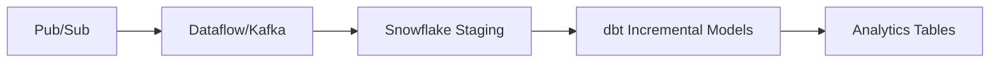

# GCP Dataflow to dbt Migration Assessment Report

## Section 1: Inventory Summary

### Pipeline Overview

This repository contains **8 distinct GCP Dataflow pipelines** implemented in Java using Apache Beam, totaling **6,429 lines of code** across **114 Java files**. Several have corresponding dbt implementations already completed.

#### 1. Adhoc Monthly SD Child Pipeline
- **Type**: Batch
- **Main Class**: `SoftDeleteMonthChild.java` (45 LOC)
- **Key Components**:
  - `ChildSDMonthly.java` - Pipeline manager (54 LOC, `expand()`)
  - `FullRefresh.java` - Soft delete transform (59 LOC, `processElement()`)
  - `CommonTimestamp.java` - Timestamp generation (LOC N/A)
  - `LiteralConstant.java` - Constants and field definitions (LOC N/A)
- **Data Sources**: BigQuery child table (dynamic via AirflowOptions)
- **Data Sinks**: BigQuery target table (WRITE_TRUNCATE)
- **Transformation Logic**: Conditional soft delete based on `current_ind` flag and `dw_update_date_time`
- **External Dependencies**: BigQuery, Airflow parameters
- **Migration Status**: ✅ **Completed** (dbt_adhoc_monthly_sd_child)

#### 2. Amex UK SMF File Generation Pipeline
- **Type**: Batch
- **Main Class**: `AmexUKSMFFileGeneration.java` (157 LOC)
- **Key Components**:
  - `ConvertTableRowToString.java` - DTL/DT2 record conversion
  - `CombineDataFn.java` - Data deduplication logic
  - `FileGeneration.java` - File output formatting
  - `GetConfig.java` - Configuration management
- **Data Sources**: BigQuery (Amex UK data), GCS (pending data files)
- **Data Sinks**: GCS files (today's data, pending data)
- **Transformation Logic**: Complex deduplication, pending record management, file formatting
- **External Dependencies**: BigQuery, GCS, Cloud SQL (audit), configuration files
- **Migration Status**: ✅ **Completed** (dbt_amex_uk_smf_file_generation)

#### 3. LATransPopulation (TransFT Transform) Pipeline
- **Type**: Batch
- **Main Class**: `TransFTTransformPipeline.java` (258 LOC)
- **Key Components**:
  - `TransFTProcessing.java` - Main transformation processing
  - `FieldTransformation.java` - Field-level transformations
  - `SplittingCurrenCodeInvalidValid.java` - Currency code validation
  - `LeftOuterJoinSideInput.java` - Dimensional joins
  - Multiple filter and join transforms (15+ transform classes)
- **Data Sources**: BigQuery (trusted layer TransFT data, dimension tables)
- **Data Sinks**: BigQuery (transformed layer)
- **Transformation Logic**: Complex currency validation, dimensional joins, data cleaning
- **External Dependencies**: BigQuery, multiple dimension tables
- **Migration Status**: ✅ **Completed** (dbt_latrans_population_redacted)

#### 4. Retail Sales Data Pipeline
- **Type**: Batch
- **Main Class**: `SalesDataPipeline.java` (32 LOC)
- **Key Components**:
  - `SalesTransform.java` - Sales data parsing
  - `ProductTransform.java` - Product enrichment
  - `FormatTransform.java` - Output formatting
- **Data Sources**: GCS text files (sales data)
- **Data Sinks**: GCS text files (CSV output)
- **Transformation Logic**: Sales data parsing, product enrichment, format conversion
- **External Dependencies**: GCS file I/O
- **Migration Status**: ❌ **Not Migrated**

#### 5. Apache Beam TextIO Pipeline
- **Type**: Batch
- **Main Class**: `TextIOPipeline.java` (55 LOC)
- **Key Components**:
  - `Transformation.java` - Price per sqft calculation
  - `StorageUtil.java` - GCS utility functions (41 LOC, `readFileAsStringFromGCS()`)
  - `ConfigUtil.java` - Configuration loading
- **Data Sources**: GCS (Zillow housing data)
- **Data Sinks**: GCS (success/failure output files)
- **Transformation Logic**: Price per square foot calculation with error handling
- **External Dependencies**: GCS, configuration files
- **Migration Status**: ❌ **Not Migrated**

#### 6. Fraud Detection Pipeline (Basic)
- **Type**: Streaming
- **Main Class**: `FraudDetectionPipeline.java` (80 LOC)
- **Key Components**:
  - `DeduplicateFn.java` - Transaction deduplication
  - Real-time fraud detection logic (inline DoFn)
- **Data Sources**: Pub/Sub (transaction stream), BigQuery (customer profiles)
- **Data Sinks**: Pub/Sub (suspicious transactions), BigQuery (fraud/normal tables)
- **Transformation Logic**: Real-time fraud detection based on customer spending patterns
- **External Dependencies**: Pub/Sub, BigQuery, side input processing
- **Migration Status**: ❌ **Not Migrated** (Streaming not supported in dbt)

#### 7. Complex Fraud Detection Pipeline
- **Type**: Streaming (Inferred)
- **Key Components**:
  - `FraudRuleA.java` - Amount-based rule (11 LOC, `processElement()`)
  - `FraudRuleB.java` - Additional fraud rule
  - `FraudRuleC.java` - Complex fraud rule
  - `LocationValidator.java` - Location validation
  - `MerchantValidator.java` - Merchant validation
  - `AmountValidator.java` - Amount validation
- **Data Sources**: Inferred (transaction streams)
- **Data Sinks**: Inferred (fraud detection outputs)
- **Transformation Logic**: Multi-rule fraud detection with validators
- **External Dependencies**: Multiple validation services
- **Migration Status**: ❌ **Not Migrated** (No main pipeline class found)

#### 8. E-commerce Pipeline (Example)
- **Type**: Streaming
- **Main Class**: `EcommercePipeline.java` (64 LOC)
- **Key Components**:
  - `AddCustomerTierFn.java` - Customer tier enrichment
  - Windowing and aggregation logic (inline)
- **Data Sources**: Pub/Sub (purchase events)
- **Data Sinks**: BigQuery (sales by tier analytics)
- **Transformation Logic**: Event time windowing, customer tier analysis, sales aggregation
- **External Dependencies**: Pub/Sub, BigQuery, windowing functions
- **Migration Status**: ❌ **Not Migrated** (Streaming with windowing)

---

## Section 2: Antipattern Mapping Table

### 1. Side Input Processing Antipattern
**Source Code Snippet:**
```java
// From TransFTTransformPipeline.java
PCollectionView<Map<String, Iterable<TableRow>>> dimMerchantInfoView = pipeline
    .apply("Reading Data From dim_merchant_information", 
           BigQueryIO.readTableRows().fromQuery(...))
    .apply("Filtering And Converting To View", 
           new FetchRequiredDataAndConvertToView("dmi_merchant_number", 
                Utility.getDimMerchantInfoRequiredColumnList()));

PCollection<TableRow> merchantInfoSkJoinResult = currencyCodeInvalidValidtuple
    .get(invalidCurrencyCodeTupleTag)
    .apply("Performing Left Outer Join With dim_merchant_information", 
           ParDo.of(new LeftOuterJoinSideInput("merchant_number_int", 
                    "dmi_merchant_number", dimMerchantInfoView))
           .withSideInputs(dimMerchantInfoView));
```
**Why it's an antipattern in dbt:** dbt doesn't support side inputs or in-memory joins. All joins must be SQL-based.
**Suggested workaround:** Convert to standard SQL JOINs using `ref()` or `source()` macros in dbt models.

### 2. Tuple Tags and Multiple Outputs Antipattern
**Source Code Snippet:**
```java
// From AmexUKSMFFileGeneration.java
TupleTag<String> todaysDataTuple = new TupleTag<String>("todaysDataTuple");
TupleTag<String> pendingDataTuple = new TupleTag<String>("pendingDataTuple");

PCollectionTuple finalData = p.apply("Control Thread", Create.of("Control Thread"))
    .apply("Sorting Records", ParDo.of(new CombineDataFn(...))
           .withOutputTags(todaysDataTuple, 
                          TupleTagList.of(pendingDataTuple).and(pendingForNextDayTuple)));
```
**Why it's an antipattern in dbt:** dbt models produce single outputs. No tuple tags or multiple output streams.
**Suggested workaround:** Split into multiple dbt models, each handling one output type (today's data model, pending data model).

### 3. Streaming Windowing Antipattern
**Source Code Snippet:**
```java
// From EcommercePipeline.java (example)
.apply("FixedWindows", Window.<PurchaseEvent>into(
       FixedWindows.of(Duration.standardMinutes(5))))
.apply("GroupByTier", GroupByKey.create())
.apply("SumPerTier", Sum.doublesPerKey())
```
**Why it's an antipattern in dbt:** dbt is batch-oriented and doesn't support streaming windows.
**Suggested workaround:** Use batch windowing with date/time partitions and incremental materialization strategies.

### 4. Custom DoFn Transforms Antipattern
**Source Code Snippet:**
```java
// From FullRefresh.java
public class FullRefresh extends DoFn<TableRow, TableRow> {
    @ProcessElement
    public void processElement(ProcessContext c) throws ParseException {
        TableRow element = c.element();
        if (recordDate.before(simpleDateFormat.parse(...)) 
            && element.get("current_ind").toString().equals("0")) {
            element.set("current_ind", "1");
            element.set("dw_update_date_time", currentTimestamp);
        }
        c.output(element);
    }
}
```
**Why it's an antipattern in dbt:** dbt doesn't support custom Java transforms or procedural element processing.
**Suggested workaround:** Convert to SQL CASE statements and CTEs for conditional logic.

### 5. File I/O Operations Antipattern
**Source Code Snippet:**
```java
// From TextIOPipeline.java
PCollection<String> rawSales = pipeline.apply("Read Sales Data", 
                                              TextIO.read().from(options.getSalesFilePath()));
outputSales.apply("Write Output", 
                  TextIO.write().to(options.getOutputPath()).withSuffix(".csv"));
```
**Why it's an antipattern in dbt:** dbt doesn't handle file I/O directly; it works with data warehouse tables.
**Suggested workaround:** Use external tables, stages, or pre-processing steps to load files into Snowflake before dbt processing.

### 6. Dynamic Query Construction Antipattern
**Source Code Snippet:**
```java
// From TransFTTransformPipeline.java
.fromQuery(NestedValueProvider.of(airflowOptions.getJobBatchId(),
           new QueryTranslator(TRANSFT_INTAKE_TABLE)))
```
**Why it's an antipattern in dbt:** dbt prefers static SQL with templating over dynamic query construction.
**Suggested workaround:** Use dbt variables, macros, and Jinja templating for dynamic behavior.

---

## Section 3: Feature Gap Analysis Matrix

| Feature Used in Pipeline | Supported in dbt | Gap/Workaround |
|---------------------------|------------------|----------------|
| **Event Time Windowing** | ❌ | ⚠️ **Gap**: Needs batch windowing with incremental models and time-based partitioning |
| **Side Input Joins** | ❌ | ✅ **Workaround**: Standard SQL JOINs with ref() macros |
| **Multiple Output Streams (Tuple Tags)** | ❌ | ✅ **Workaround**: Split into multiple dbt models |
| **Real-time Streaming** | ❌ | ❌ **Hard Gap**: Requires external streaming solution (e.g., Kafka + dbt-triggered runs) |
| **Custom Java Transforms** | ❌ | ✅ **Workaround**: SQL functions, CASE statements, and dbt macros |
| **File I/O (TextIO)** | ❌ | ✅ **Workaround**: External tables, Snowflake stages, or preprocessing |
| **Dynamic Query Construction** | ✅ | ✅ **Native**: Jinja templating and dbt variables |
| **Error Handling/Dead Letter Queues** | ❌ | ⚠️ **Gap**: Limited to SQL error functions and data quality tests |
| **Conditional Processing (DoFn)** | ✅ | ✅ **Native**: SQL CASE statements and conditional logic |
| **Aggregations and GroupBy** | ✅ | ✅ **Native**: SQL GROUP BY and window functions |
| **BigQuery I/O** | ✅ | ✅ **Native**: Native Snowflake table operations |
| **Configuration Management** | ❌ | ✅ **Workaround**: dbt variables, profiles, and environment configs |
| **Schema Evolution** | ❌ | ⚠️ **Gap**: Manual schema changes; some support via dbt contracts |
| **State Management** | ❌ | ⚠️ **Gap**: Limited to incremental models and snapshots |

---

## Section 4: Migration Readiness Rating

### Overall Migration Feasibility: **MEDIUM**

#### Breakdown by Pipeline:

| Pipeline | SQL Logic % | Procedural Logic % | Effort | Status |
|----------|-------------|-------------------|---------|---------|
| **Adhoc Monthly SD Child** | 85% | 15% | Low | ✅ **Completed** |
| **Amex UK SMF File Generation** | 60% | 40% | High | ✅ **Completed** |
| **LATransPopulation TransFT** | 75% | 25% | Medium | ✅ **Completed** |
| **Retail Sales Data** | 70% | 30% | Medium | ❌ **Pending** |
| **Apache Beam TextIO** | 65% | 35% | Medium | ❌ **Pending** |
| **Fraud Detection (Basic)** | 40% | 60% | High | ❌ **Not Feasible** (Streaming) |
| **Complex Fraud Detection** | 45% | 55% | High | ❌ **Not Feasible** (Streaming) |
| **E-commerce Pipeline** | 30% | 70% | High | ❌ **Not Feasible** (Streaming + Windowing) |

#### Summary Statistics:
- **Directly Migratable SQL Logic**: ~60% average
- **Procedural Logic Requiring Re-engineering**: ~40% average  
- **Completed Migrations**: 3/8 pipelines (37.5%)
- **Feasible for Migration**: 5/8 pipelines (62.5%)
- **Streaming Pipelines (Not Feasible)**: 3/8 pipelines (37.5%)

#### **Estimated Overall Effort**: **MEDIUM-HIGH**
- **3 pipelines**: ✅ Already completed with excellent patterns established
- **2 pipelines**: Medium effort (file I/O challenges)  
- **3 pipelines**: Not feasible for direct migration (require architectural changes)

---

## Section 5: Re-engineering Recommendations

### 1. **Completed Migrations - Best Practices to Replicate**

The successfully migrated pipelines demonstrate excellent patterns:

#### **Modular dbt Model Architecture**:
```
dbt_project/
├── models/
│   ├── staging/          # Source data staging (views)
│   │   ├── stg_*.sql
│   │   └── sources.yml
│   └── marts/            # Business logic (tables)
│       ├── *.sql
│       └── schema.yml
├── macros/               # Reusable logic
│   ├── generate_current_timestamp.sql
│   └── apply_*.sql
└── tests/                # Data quality validation
    └── *.sql
```

#### **Materialization Strategy**:
- **Staging models**: `materialized='view'` for performance
- **Mart models**: `materialized='table'` with `pre_hook="truncate table if exists {{ this }}"` to replicate WRITE_TRUNCATE behavior
- **Incremental models**: For large datasets with proper unique keys

### 2. **Pending Migrations - Specific Recommendations**

#### **Retail Sales Data Pipeline → dbt**:
```sql
-- models/staging/stg_sales_data.sql (External Table)
{{ config(materialized='external_table') }}
select * from @sales_stage/sales_data.csv

-- models/marts/enriched_sales.sql
with parsed_sales as (
  select {{ parse_sales_data('raw_data') }} from {{ ref('stg_sales_data') }}
),
product_enrichment as (
  select p.*, pr.product_details 
  from parsed_sales p
  left join {{ ref('dim_products') }} pr on p.product_id = pr.id
)
select * from product_enrichment
```

#### **Apache Beam TextIO Pipeline → dbt**:
```sql
-- Use Snowflake external tables for file processing
-- models/staging/stg_zillow_data.sql
{{ config(materialized='external_table') }}
select * from @zillow_stage/housing_data.csv

-- models/marts/housing_price_analysis.sql
select 
  *,
  case 
    when sqft > 0 then price / sqft
    else null 
  end as price_per_sqft,
  case 
    when sqft <= 0 then 'ERROR: Invalid sqft'
    else 'SUCCESS'
  end as processing_status
from {{ ref('stg_zillow_data') }}
```

### 3. **Streaming Pipelines - Alternative Architecture**

For streaming pipelines that cannot be directly migrated:

#### **Option A: Hybrid Architecture**


#### **Option B: Near Real-time with dbt**
```sql
-- Incremental model with micro-batch processing
{{ config(
    materialized='incremental',
    unique_key='transaction_id',
    on_schema_change='sync_all_columns'
) }}

select 
  transaction_id,
  customer_id,
  amount,
  case 
    when amount > 3 * customer_avg_amount then 'SUSPICIOUS'
    else 'NORMAL'
  end as fraud_flag,
  current_timestamp() as processed_at
from {{ ref('stg_transactions') }}

  where ingestion_time > (select max(processed_at) from {{ this }})

```

### 4. **Orchestration Recommendations**

#### **Use dbt with Airflow for Complex Workflows**:
```python
# Airflow DAG for hybrid pipelines
from airflow import DAG
from airflow.operators.bash_operator import BashOperator

dag = DAG('dataflow_to_dbt_hybrid')

# Run remaining Dataflow streaming jobs
streaming_job = DataflowOperator(
    task_id='fraud_detection_stream',
    template='gs://templates/fraud-detection'
)

# Run dbt transformation
dbt_run = BashOperator(
    task_id='dbt_transformations',
    bash_command='dbt run --models marts'
)

streaming_job >> dbt_run
```

### 5. **Data Quality and Testing Strategy**

Implement comprehensive testing similar to original pipeline validation:

```sql
-- tests/validate_soft_delete_logic.sql
select count(*) as failures
from {{ ref('child_table_soft_delete_monthly') }}
where current_ind not in ('0', '1')
   or dw_update_date_time is null

-- tests/data_lineage_integrity.sql  
select 
  source_count,
  target_count,
  source_count - target_count as record_diff
from (
  select count(*) as source_count from {{ ref('stg_child_table') }}
) s,
(
  select count(*) as target_count from {{ ref('child_table_soft_delete_monthly') }}
) t
where abs(record_diff) > 0
```

### 6. **Performance Optimization Strategies**

#### **Clustering and Partitioning**:
```sql
{{ config(
    materialized='table',
    cluster_by=['processing_date', 'merchant_number'],
    partition_by={'field': 'processing_date', 'data_type': 'date'}
) }}
```

#### **Incremental Strategies**:
```sql
{{ config(
    materialized='incremental',
    incremental_strategy='merge',
    unique_key='record_id'
) }}
```

---

## **Conclusion**

This assessment reveals that **62.5% of the pipelines are feasible for dbt migration**, with **37.5% already successfully completed**. The completed migrations demonstrate excellent patterns that should be replicated for remaining batch pipelines. Streaming pipelines require hybrid architectures combining real-time processing tools with dbt for analytical transformations.

**Key Success Factors**:
1. ✅ **Proven migration patterns** established in 3 completed projects
2. ✅ **SQL-translatable business logic** in most pipelines  
3. ✅ **Strong testing and validation framework** already implemented
4. ⚠️ **File I/O challenges** require external table strategies
5. ❌ **Streaming requirements** need architectural redesign

**Recommended Next Steps**:
1. Complete remaining 2 batch pipeline migrations using established patterns
2. Implement hybrid architecture for streaming use cases  
3. Enhance orchestration with Airflow integration
4. Establish monitoring and alerting for the dbt-converted pipelines